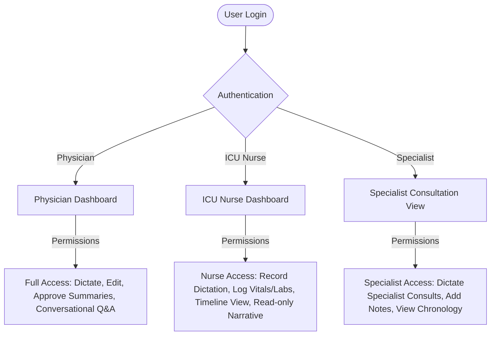

# Medico-Agent: Clinical AI Companion Platform
## Complete Architectural Blueprint & Collaborator Guide

Welcome to the comprehensive developer and collaborator guide for **Medico-Agent**. This document aggregates the complete architectural context, RAG design pipelines, database schema, codebase mapping, and setup instructions from the project's inception.

---

## 1. Project Overview & Clinical Problem
**Medico-Agent** is an evidence-based clinical retrieval and reasoning platform designed specifically for pulmonologists and critical care consultants. In high-acuity environments (like the ICU), physicians are inundated with scattered data across multiple systems. Medico-Agent solves this by aggregating dictations, scans, and labs into a structured clinical event ledger and providing a multi-turn, context-grounded AI copilot.

### Key Objectives
* **Timeline Chronology**: Consolidate patient transfers, milestones, and vital trends.
* **Medication Reconciliation**: Provide clear audits of held, started, and stopped medications (e.g., holding anticoagulants during active hemorrhage).
* **Automated Discharge drafting**: Enable 1-click discharge compilation based on hospital events, avoiding manual charting errors.

---

## 2. In-Depth System Architecture (The 11-Layer Pipeline)

Rather than running simple document-based vector retrieval, Medico-Agent utilizes an **Event-Centric Clinical Memory** system organized across 11 layers:

```
[Raw Inputs] (Voice, PDFs, Scans, CT/X-Rays)
       │
       ▼  (Layer 1-3: Data Ingestion & Extraction)
[Clinical Knowledge Extraction Layer]
 ├── Diagnosis Extraction
 ├── Medication Extraction (drug, dose, route, freq, status)
 ├── Procedure Extraction
 ├── Timeline Extraction (clinical event times)
 ├── Lab Abnormality Detection (values + thresholds)
 └── Radiology Findings Extractor (CT/X-Rays -> Textual Findings)
       │
       ▼  (Layer 4-5: Memory & Retrieval)
[Structured Memory / Clinical Event Object (CEO) Ledger]
       │
       ▼
[Query Router] (TIMELINE, MEDICATION, IMAGING, DISCHARGE, GENERAL)
       │
       ▼
[Hybrid Retrieval Engine]
 ├── Vector Semantic Search (pgvector/Cosine Similarity)
 ├── Keyword Exact Match (Postgres tsquery / SQL Keyword Filters)
 └── Metadata Filtering (patient_id, encounter_id, date)
       │
       ▼  (Layer 6-7: Context & Narrative Compilation)
[Context Assembly & Reasoning] (Gemini 2.5 Flash / systemInstruction)
       │
       ▼  (Layer 8-11: Safety, RBAC, & Output)
[Safety Dosage Validation & Clinician Review/Sign-Off]
```

### Breakdown of the 11 Layers

#### Layers 1-3: Data Sources to Understanding
1. **Data Ingestion**: Accepts unstructured voice notes (e.g., physician round dictations), scanned clinical records, and raw imaging (radiology reports).
2. **Vision-to-Clinical-Findings Pipeline**: Instead of vectorizing raw chest X-rays directly, the system runs them through a vision model (or mock extractor) to generate **Textual Clinical Findings** (e.g., *"Chest CT shows diffuse alveolar infiltrates and patchy consolidation bilaterally"*), which are stored as indexable text.
3. **Structured Event Normalization**: Clinical text is parsed into a structured **Clinical Event Object (CEO)**.

#### Layers 4-5: Memory & Retrieval
4. **Hybrid Search Store**: Clinical memory is divided into **Structured Memory** (relational tables tracking patients, beds, users) and **Unstructured Memory** (notes, raw logs).
5. **Hybrid Retrieval**: Combines:
   - *Metadata Filtering*: Enforces strict isolation by `patient_id` to prevent wrong-patient crossover leaks.
   - *Keyword Exact Matches*: Ensures numeric lab values (e.g., Creatinine `3.8 mg/dL`) or medication dosages are matched exactly.
   - *Vector Search*: Captures conceptual queries.

#### Layers 6-7: Context & Narrative
6. **Chronology Compilation**: Sorts and builds the clinical events chronologically.
7. **Narrative Generation**: Rebuilds the narrative tables (*Course in Hospital*, *Medication Journey*, *Investigation Journey*, *Procedure Journey*) whenever new events are ingested.

#### Layers 8-11: Application to Output
8. **Clinical Copilot UI**: Interactive chatbot with grounded source citations and context retention.
9. **Safety & Dosage Alerts**: Validation checks for medication contradictions.
10. **Role-Based Access Control (RBAC)**: REST API enforcement by role.
11. **Clinical Document Output**: Exports finalized PDF/JSON discharge summaries.

---

## 3. Multi-User Access Control (RBAC) Matrix

To support inpatient workflows, access is controlled directly via Clerk identities and API headers:



| Role | Core Workflow Activities | Key Permissions & UI Views |
| :--- | :--- | :--- |
| **Physician / Attending** | Clinical rounds, prescribing, final discharge approval. | Full edit and approval permissions for the *Discharge Summary*. Access to the conversational clinical Copilot. |
| **ICU Nurse / Ward Nurse** | Vitals ingestion, clinical event tracking, logging medication checkpoints. | Input of nursing log dictations, view timeline ledger and active medication checklist. Read-only access to narrative summaries. |
| **Consulting Specialist** | Specialty consultations (e.g., Nephrology consult for dialysis). | Can log a *Consultation Note* under their specialty. View restricted timeline of patient journey. |

---

## 4. Technical Stack selection
* **Frontend**: React (TypeScript) + Vite + TailwindCSS. Employs **Clerk** for multi-user authentication.
* **Backend**: FastAPI + Uvicorn (chosen for direct integration of Python AI, OCR, and NLP extraction pipelines).
* **Database**: SQLite (local dev) with SQLAlchemy ORM. Designed to replicate Supabase PostgreSQL + `pgvector` schemas.

---

## 5. Master Codebase Directory Map

### Backend (Python/FastAPI) — `backend/app/`
* **[main.py](file:///C:/Users/eshaa/Documents/antigravity/hopeful-hubble/backend/app/main.py)**: Gatekeeper initializing CORS middlewares and registering endpoints.
* **[database.py](file:///C:/Users/eshaa/Documents/antigravity/hopeful-hubble/backend/app/database.py)**: SQLite database engine, session makers, and dependency injects.
* **[models.py](file:///C:/Users/eshaa/Documents/antigravity/hopeful-hubble/backend/app/models.py)**: Contains schemas for `User`, `Patient`, `Bed` (16 ICU + 2 Ward beds), `ClinicalEvent` (storing JSON-based CEO payloads), `Narrative`, and `AuditLog`.
* **[routers/narratives.py](file:///C:/Users/eshaa/Documents/antigravity/hopeful-hubble/backend/app/routers/narratives.py)**: Handles clinical narratives, `/compile-discharge/{patient_id}` compilation, and the core `/copilot/{patient_id}` chat route.
* **[utils/routing.py](file:///C:/Users/eshaa/Documents/antigravity/hopeful-hubble/backend/app/utils/routing.py)**:
  - **`QueryRouter`**: Rules to detect intent (Timeline, Medication, Imaging, Discharge, or General).
  - **`HybridSearchEngine`**: Relevance-scores events based on keyword hits, query-route boost, and recency decay.
  - **`call_llm_copilot`**: Handles construction of conversation history (`role: "user" | "model"`) and maps the patient context to Gemini `systemInstruction`.
* **[routers/ingest.py](file:///C:/Users/eshaa/Documents/antigravity/hopeful-hubble/backend/app/routers/ingest.py)**: Ingests clinical notes, validates fields, and automatically triggers narrative regeneration.
* **[utils/nlp.py](file:///C:/Users/eshaa/Documents/antigravity/hopeful-hubble/backend/app/utils/nlp.py)**: Extract entities using Gemini 1.5 with heuristics fallback rules.

### Frontend (React/TypeScript) — `frontend/src/`
* **[context/AppContext.tsx](file:///C:/Users/eshaa/Documents/antigravity/hopeful-hubble/frontend/src/context/AppContext.tsx)**: Main React Context. Holds the active patient, loading indicators, active tab state, and the Gemini API key.
* **[pages/PatientPortal.tsx](file:///C:/Users/eshaa/Documents/antigravity/hopeful-hubble/frontend/src/pages/PatientPortal.tsx)**: main physician workspace. Incorporates the chronological Event Ledger, care milestones checklist, and the clinical copilot sidebar chat (which serializes and submits conversation history).
* **[components/TopBar.tsx](file:///C:/Users/eshaa/Documents/antigravity/hopeful-hubble/frontend/src/components/TopBar.tsx)**: Navigation header containing the patient search dropdown and the API Key configuration slide-out.

---

## 6. Schema Structures

### Clinical Event Object (CEO) payload Schema
All events are stored as structured JSON inside the `ClinicalEvent.event_data` field:
```json
{
  "patient_id": "rajinder-sharma-uuid",
  "event_type": "MEDICATION",
  "event_time": "2026-06-11T05:39:52Z",
  "source_modality": "TEXT",
  "event_data": {
    "drugName": "Eliquis",
    "dose": "5mg",
    "route": "oral",
    "freq": "BD",
    "status": "stopped",
    "reason": "Active hemorrhage / pulmonary bleeding"
  },
  "provenance": "Physician Direct Order"
}
```

---

## 7. Background Medical Documents Reference
The following files in the project root folder contain validation data and guidelines:
* **`rAJENDER NATH SHARMA.pdf`**: Clinical case details (active patient: 68M with CKD 5 on hemodialysis, admitting with Diffuse Alveolar Hemorrhage).
* **`Rules.docx`**: System safety rules, RBAC restrictions, and discharge summary validation schemas.
* **`AI-Assisted Clinical Documentation Platform for Doctors.docx`**: Platform specifications, data integration constraints, and design systems guidelines.
* **`clinical_multimodal_ai_workflow_documentation_v2.docx`**: Workflows outlining RAG timeline constraints and multi-turn clinical search algorithms.

---

## 8. How to Setup & Run locally

### Backend Setup
1. Open a terminal in `backend/` and activate the virtual environment:
   ```bash
   .\venv\Scripts\activate
   ```
2. Install Python dependencies:
   ```bash
   pip install -r requirements.txt
   ```
3. Run the database seed script to populate `medico.db` with clinical data for Rajinder Nath Sharma:
   ```bash
   python scripts/seed.py
   ```
4. Start the FastAPI development server:
   ```bash
   python -m uvicorn app.main:app --host 127.0.0.1 --port 5000 --reload
   ```

### Frontend Setup
1. Open a terminal in `frontend/` and install node packages:
   ```bash
   npm install
   ```
2. Start the Vite React development server:
   ```bash
   npm run dev
   ```
3. Open your browser and navigate to `http://localhost:5173`.
