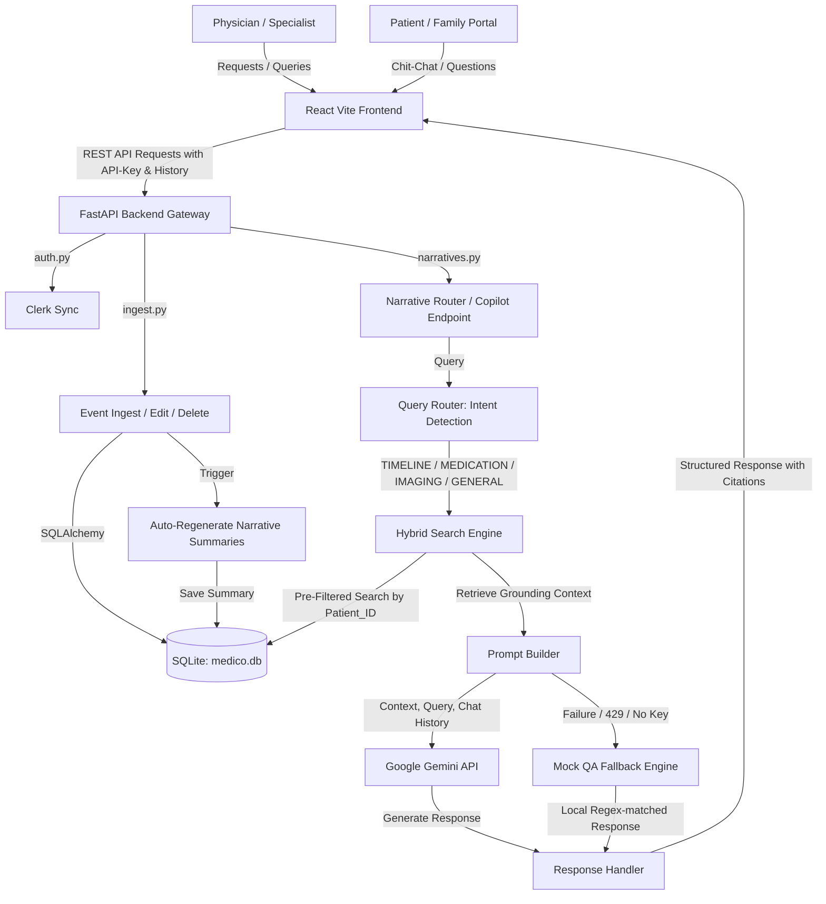

# Medico-Agent: Clinical AI Companion Platform
## Collaborator & Developer Guide

Welcome to the **Medico-Agent** developer guide. This document outlines the system architecture, core workflows, database schema, codebase structure (master files), and local setup instructions.

---

## 1. Project Summary & Core Value
**Medico-Agent** is a specialized clinical AI platform designed for Pulmonology and Critical Care Physicians. It addresses the massive burden of clinical charting and review in high-acuity environments (like the ICU) by:
1. **Aggregating the Patient Journey**: Consolidating clinical events (medications, investigations, consultations, procedures) into a chronological event ledger.
2. **Context-Aware RAG Copilot**: Providing an AI chat companion that retains conversational history and compiles answers grounded in patient demographics and the clinical ledger.
3. **Automated Discharge Summaries**: Generating a structured 1-click discharge summary based on the patient's course in the hospital, active medications, and resolved milestones.

---

## 2. Technical Stack
* **Frontend**: React (TypeScript), Vite, TailwindCSS (for clean layouts), Clerk (for identity management).
* **Backend**: FastAPI (Python 3.12), SQLite (local database), SQLAlchemy (ORM).
* **AI Engine**: Google Gemini API (utilizing `gemini-2.5-flash`), with a robust local mock fallback for offline development or quota limits.

---

## 3. System Architecture & Data Flow

Below is the conceptual architecture showing how data flows between the user interface, the API routers, the search engine, and the Gemini API:



---

## 4. Master Codebase Directory Map

### Backend (Python/FastAPI) — `backend/app/`
* **[main.py](file:///C:/Users/eshaa/Documents/antigravity/hopeful-hubble/backend/app/main.py)**: The application entry point. Configures CORS headers and registers the API endpoints (`auth`, `patients`, `census`, `ingest`, `narratives`, `safety`, `audit`).
* **[database.py](file:///C:/Users/eshaa/Documents/antigravity/hopeful-hubble/backend/app/database.py)**: Manages SQLite engine creation, metadata bindings, and database session injections.
* **[models.py](file:///C:/Users/eshaa/Documents/antigravity/hopeful-hubble/backend/app/models.py)**: Declares ORM entities:
  - `User`: Clinicians, nurses, or specialists.
  - `Patient`: Patient demographics (name, MRN, age, bed assignment, milestones).
  - `Bed`: ICU/Ward bed allocations.
  - `ClinicalEvent`: Ingested timeline entries (medication changes, labs, scans).
  - `Narrative`: Auto-compiled longitudinal narrative summaries of the hospital course.
  - `AuditLog`: Security tracking for logins, narrative edits, and discharge compile actions.
* **[routers/narratives.py](file:///C:/Users/eshaa/Documents/antigravity/hopeful-hubble/backend/app/routers/narratives.py)**:
  - Handles narrative retrievals and manual updates.
  - Core endpoint `/copilot/{patient_id}`: parses query and `history`, triggers semantic search, and forwards data to the RAG copilot.
  - Endpoint `/compile-discharge/{patient_id}`: compiles discharge summaries.
* **[utils/routing.py](file:///C:/Users/eshaa/Documents/antigravity/hopeful-hubble/backend/app/utils/routing.py)**:
  - **`QueryRouter`**: Rules to detect intent (Timeline, Medication, Imaging, Discharge, or General).
  - **`HybridSearchEngine`**: Pre-filters by patient ID and uses keyword/semantic score algorithms to pull the most relevant events.
  - **`call_llm_copilot`**: Builds standard multi-turn conversation payloads (`role`: `"user"` | `"model"`) along with the RAG patient context as a `systemInstruction`, making POST requests to the Gemini API.
* **[routers/ingest.py](file:///C:/Users/eshaa/Documents/antigravity/hopeful-hubble/backend/app/routers/ingest.py)**:
  - Endpoint `/event`: handles ingestion of raw medical notes and records.
  - Triggers the NLP pipeline to rebuild the patient's narrative summaries whenever new information is added to the ledger.

---

### Frontend (React/TypeScript) — `frontend/src/`
* **[context/AppContext.tsx](file:///C:/Users/eshaa/Documents/antigravity/hopeful-hubble/frontend/src/context/AppContext.tsx)**: Main application state manager. Handles:
  - Active patient selections.
  - Loading indicators, notification alerts, and API settings.
  - Gemini API key storage (loads from `import.meta.env.VITE_GEMINI_API_KEY` or user settings).
* **[pages/PatientPortal.tsx](file:///C:/Users/eshaa/Documents/antigravity/hopeful-hubble/frontend/src/pages/PatientPortal.tsx)**: The main physician dashboard interface.
  - Left panel: Active patient demographic summary, care team, and care milestones.
  - Middle panel: Chronological Clinical Ledger (filter by category: Medication, Scans, Labs, Consultations).
  - Right panel / Companion sidebar: **Clinical Copilot Chatbox**. Collects messages, maps the chat history array, and sends query/history payloads to the backend API.
* **[components/TopBar.tsx](file:///C:/Users/eshaa/Documents/antigravity/hopeful-hubble/frontend/src/components/TopBar.tsx)**: Top bar with patient quick search, user profile controls, and the Gemini API key settings drawer.

---

## 5. Medical Documents Reference (Root Folder)
The root directory includes critical background documentation and patient files used for design validation:
* **`rAJENDER NATH SHARMA.pdf` (and `.txt`)**: The clinical case file for the primary test patient (68-year-old male with Stage 5 CKD, DAH, CAD). Contains the timeline, medication adjustments, and ICU flowsheet data used to populate the local seed database.
* **`Rules.docx`**: Design and security requirements outlining permission models (e.g. nurses cannot edit narratives; only attending physicians can compile and sign off on discharge documentation).
* **`AI-Assisted Clinical Documentation Platform for Doctors.docx`**: Platform specifications, data integration constraints, and design systems guidelines.
* **`clinical_multimodal_ai_workflow_documentation_v2.docx`**: Workflows outlining RAG timeline constraints and multi-turn clinical search algorithms.

---

## 6. How to Run & Test Locally

### Backend Setup
1. Open a terminal in `backend/` and activate the virtual environment:
   ```bash
   .\venv\Scripts\activate
   ```
2. Install Python dependencies:
   ```bash
   pip install -r requirements.txt
   ```
3. Run the database seed script to populate `medico.db` with clinical data for Rajinder Nath Sharma:
   ```bash
   python scripts/seed.py
   ```
4. Start the FastAPI development server:
   ```bash
   python -m uvicorn app.main:app --host 127.0.0.1 --port 5000 --reload
   ```

### Frontend Setup
1. Open a terminal in `frontend/` and install node packages:
   ```bash
   npm install
   ```
2. Start the Vite React development server:
   ```bash
   npm run dev
   ```
3. Open your browser and navigate to `http://localhost:5173`.

### Adding API Keys
- Create a `.env` file in the `frontend/` folder:
  ```env
  VITE_GEMINI_API_KEY=your_gemini_api_key_here
  ```
- Or enter your key in the **Settings** panel directly inside the web UI.
